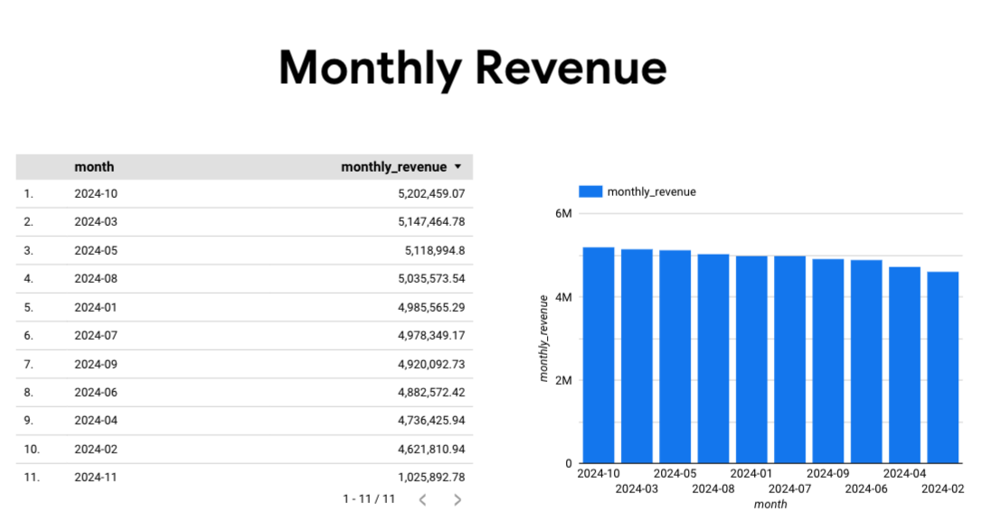
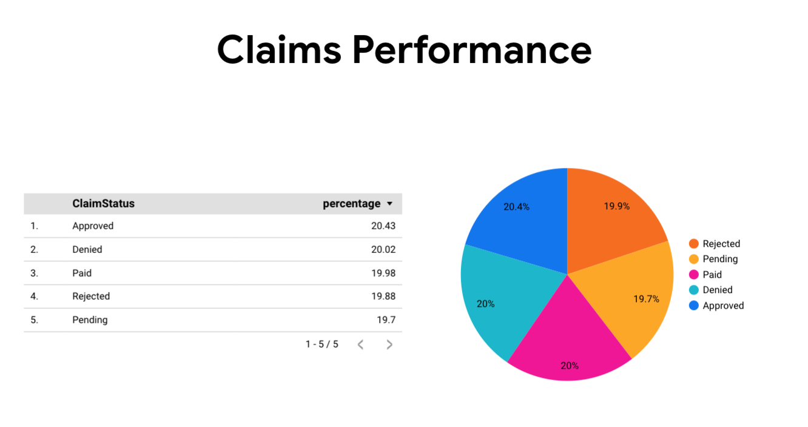
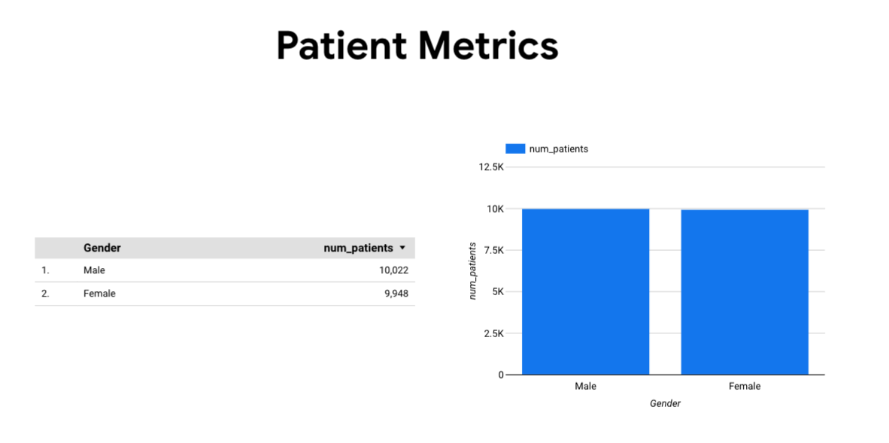
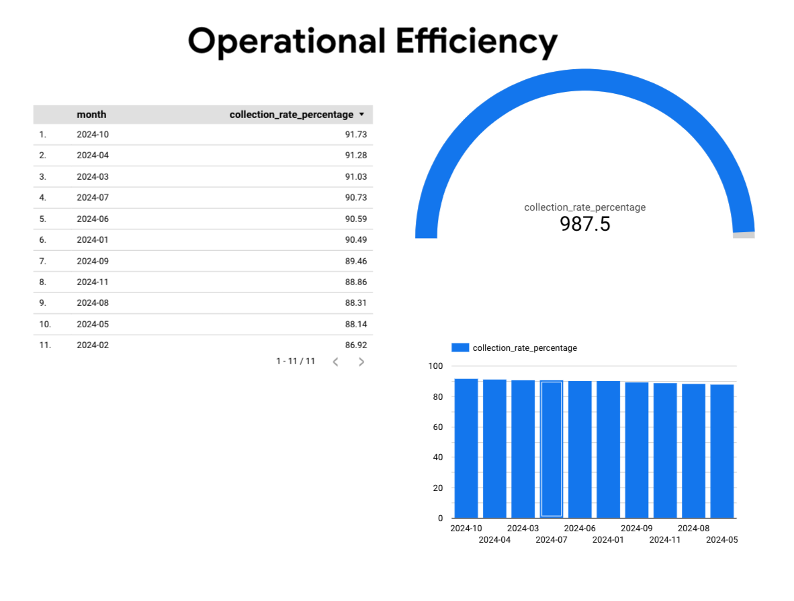

# Healthcare Revenue Cycle Management (RCM) Data Pipeline

##  Project Overview

This project simulates a real-world scenario focused on optimizing healthcare revenue cycle management through a comprehensive data engineering solution. The system consolidates fragmented data from two disparate hospital systems into a unified, actionable format using a robust, scalable ETL pipeline.

The solution addresses critical challenges in healthcare revenue management by integrating data from multiple sources, implementing rigorous data quality measures, and providing business-ready analytics housed securely within Google BigQuery for immediate insights and decision-making.

---
##  Objectives

### Technical Objectives
- **Data Integration**: Integrate diverse data sources from MySQL databases of both hospitals and supplementary CSV files containing claims data
- **Data Quality**: Implement rigorous validation, cleansing, and unification processes to ensure high data quality and consistency
- **Historical Tracking**: Apply Slowly Changing Dimensions (SCD) Type 2 methodology to maintain comprehensive historical records of patient information
- **Cloud Data Warehousing**: Load transformed, high-quality data into Google BigQuery for scalable analytics and efficient querying
- **KPI Enablement**: Structure data to seamlessly enable tracking of key performance indicators for revenue cycle management

---
### Business Objectives
- Eliminate data silos between hospital systems
- Reduce manual claim processing delays
- Implement comprehensive historical patient data tracking
- Minimize revenue leakage and compliance risks
- Enable data-driven decision making for healthcare operations

---
##  Tech Stack

### Programming & Databases
- **Python**: Primary language for ETL logic, scripting, and data manipulation
- **SQL**: Database interactions, querying, and data definition
- **MySQL**: Source databases for patient and hospital operational data
- **BigQuery**: Cloud data warehouse for final storage and analytics

---
### Libraries & Tools
- **Pandas**: Data manipulation and analysis within Python
- **SQLAlchemy**: ORM for database interactions and connections
- **Google-Cloud-BigQuery**: Python client library for BigQuery integration
- **mysql-connector-python**: MySQL database connectivity
- **VSCode & Google Colab**: Development environments

---
## 🏗 Architecture

---

## 📊 Project Phases

### Phase 1: Environment Setup
Set up MySQL databases, BigQuery environment, and Python dependencies with proper authentication and connectivity testing.

### Phase 2: Data Extraction
Built DataExtractor class to connect and extract patient, provider, and transaction data from both hospital MySQL databases and CSV claims files.

### Phase 3: Data Transformation
Implemented comprehensive data cleaning, standardization, business logic, and created unified patient identifiers across hospital systems.

### Phase 4: Dimensional Modeling
Designed star schema with fact tables (transactions, claims) and dimension tables (patients, providers, procedures, dates) for efficient analytics.

### Phase 5: SCD Type 2 Implementation
Applied Slowly Changing Dimensions Type 2 to track historical changes in patient information with version control and audit trails.

### Phase 6: BigQuery Integration
Created optimized BigQuery schemas with partitioning and clustering, loaded dimensional model, and implemented comprehensive data validation.

### Phase 7: RCM Analytics
Developed SQL queries for key performance indicators including revenue metrics, claims performance, patient analytics, and operational efficiency measures.

---
## 📈 Analytics Dashboards

### Revenue Metrics Dashboard

---
### Claims Performance Dashboard

---
### Patient Analytics Dashboard

*Insert screenshot of patient volume, demographics, and insurance mix analytics*

---
### Operational Efficiency Dashboard

---
##  Project Presentation

 **[Project PPT](https://gamma.app/docs/Healthcare-Revenue-Cycle-Management-RCM-Data-Pipeline-0onni7tcs1ybpa9)**

---
##  Key Results

- **Scale**: Successfully processed 10,000+ patient records
- **Quality**: Achieved >99% data quality through comprehensive validation and cleansing
- **Performance**: Implemented end-to-end automated pipeline from MySQL + CSV to BigQuery
- **Compliance**: Full historical tracking using SCD Type 2 for audit requirements
- **Analytics**: Enabled real-time KPI tracking and revenue optimization insights

---
##  Technical Achievements

- **ETL Pipeline**: Robust, automated data pipeline with comprehensive error handling
- **Data Quality**: Implemented validation frameworks and quality scoring mechanisms
- **Scalability**: Cloud-native architecture supporting growing data volumes
- **Performance**: Optimized BigQuery implementation with partitioning and clustering
- **Maintainability**: Well-documented, modular code structure for production deployment

---

**Developed by: Vasavi Anusha Botta**

*This project demonstrates expertise in healthcare data engineering, ETL pipeline development, cloud data warehousing, and business intelligence analytics.*